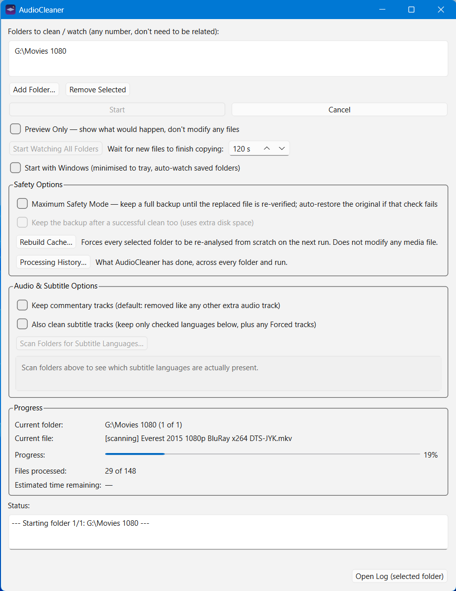

# 🎧 AudioCleaner

<p align="center">
  <strong>Automatically keep the best English audio track in your MKV library.</strong>
</p>

<p align="center">
  A lightweight Windows utility that safely removes unwanted audio tracks without re-encoding your media.
</p>

<p align="center">
  <a href="https://github.com/quinnuk/audiocleaner/releases/latest">
    
  </a>
  
  
  
  <a href="https://github.com/quinnuk/audiocleaner/actions/workflows/tests.yml">
    
  </a>
</p>
<p align="center">
  <a href="https://buymeacoffee.com/quinnuk" target="_blank">
    
  </a>
  <br>
  <sub>If AudioCleaner saves you disk space, a coffee is always appreciated ☕</sub>
</p>
<p align="center">
  
</p>

---

## 📑 Contents

- [What is AudioCleaner?](#-what-is-audiocleaner)
- [Safe by Design](#️-safe-by-design)
- [Key Features](#-key-features)
- [Getting Started](#-getting-started)
- [How It Works](#️-how-it-works)
- [Subtitle Language Filtering](#️-subtitle-language-filtering)
- [Watch Mode, System Tray & Autostart](#-watch-mode-system-tray--autostart)
- [Headless CLI Mode](#️-headless-cli-mode)
- [Smart Caching](#-smart-caching)
- [Codec Detection Caveat](#️-codec-detection-caveat)
- [Building a Standalone .exe](#-building-a-standalone-exe)
- [Repo Notes](#-repo-notes)
- [Project Structure](#-project-structure)
- [External Dependencies](#-external-dependencies)
- [Development & Testing](#-development--testing)
- [Support This Project](#-support-this-project)
- [License](#-license)

---

## ✨ What is AudioCleaner?

AudioCleaner is a simple, **"set it and forget it" Windows application** (with an optional headless CLI mode for servers/Docker) that recursively scans your MKV library and keeps exactly one best-quality audio track per file — English by default, with other languages selectable via the CLI.

It is designed to be safe and hands-off:

**Point it at your library → Start it → Let it do the work.**

Dolby Atmos always wins when present, and AudioCleaner never re-encodes your media.

### 🔊 Audio Quality Priority

English audio tracks are ranked in this order:

**Atmos + TrueHD → DTS:X → TrueHD → DTS-HD MA → LPCM → FLAC → E-AC3 → DTS → AC3 → AAC → MP3**

---

## 🛡️ Safe by Design

AudioCleaner is deliberately conservative when modifying your media.

It **only remuxes** files — video and audio are never re-encoded, so there is no quality loss.

The following are preserved:

- 🎬 Video
- 💬 Subtitles
- 📖 Chapters
- 🔤 Fonts
- 📎 Attachments
- 🏷️ Metadata

Every file follows a safe temporary-file workflow:

```text
Original MKV
     │
     ▼
 Analyse tracks (mkvmerge + MediaInfo, run in parallel)
     │
     ▼
 Select best English track
     │
     ├─────────────── ❓ Unrecognised codec
     │                    │
     │                    ▼
     │              Skip file, leave untouched
     │
     ▼
 Create temporary MKV (name.ac_tmp.mkv)
     │
     ▼
 Verify result (video, audio, subtitles, chapters,
 attachments, duration, output size)
     │
     ├─────────────── ❌ Failed
     │                    │
     │                    ▼
     │              Delete temp file
     │              Keep original
     │
     └─────────────── ✅ Passed
                          │
                          ▼
              Atomically replace original (os.replace)
                          │
                          ▼
              Re-probe the replaced file to confirm
              the swap actually landed correctly
```

The original file is **never replaced until the new file has been successfully created and verified**, and the replacement itself is re-checked afterwards rather than just assumed to have worked.

If anything fails, the original remains untouched. If a file's audio codec can't be confidently classified, it's skipped rather than guessed at.

### Maximum Safety Mode

For an extra layer of protection, **Maximum Safety Mode** keeps a full backup copy of the original file until *after* the post-replacement check has confirmed the swap succeeded. If that final check ever fails, the backup is used to automatically restore the original — no manual recovery needed.

It's off by default because the standard temp-file → verify → replace flow is already safe for normal use, and Maximum Safety Mode costs extra disk space and I/O while it runs. There's also an option to keep the backup even after a successful run, for anyone who wants a persistent safety net rather than a one-off check.

Enable it from **Safety Options** in the app.

---

## ✨ Key Features

| | Feature | Description |
|---|---|---|
| 🎯 | **Smart Track Selection** | Keeps exactly one, best-quality English audio track |
| 🔊 | **Atmos Priority** | Dolby Atmos is preferred whenever available |
| ⚡ | **Zero Quality Loss** | Remuxes only — never re-encodes video or audio |
| 🛡️ | **Safe Processing** | Builds, verifies, and then atomically replaces the original |
| 👁️ | **Watch Mode** | Automatically processes new MKVs as they arrive |
| 📁 | **Multiple Folders** | Monitor libraries across different drives at once |
| 💾 | **Smart Caching** | Caches metadata so unchanged libraries scan quickly |
| 🖥️ | **System Tray** | Runs quietly in the background |
| 🚀 | **Windows Startup** | Automatically starts and resumes watching at login |
| 📋 | **Detailed Logging** | Records every processing decision |
| 🔒 | **Maximum Safety Mode** | Keeps a backup until the replaced file is re-verified, and auto-restores it if that check fails |
| 🕵️ | **Processing History** | A searchable, persistent record of what was done to every file, across every folder and run |
| 🎙️ | **Commentary Track Control** | Choose whether commentary tracks are removed (default) or kept alongside the main audio track |
| 💬 | **Subtitle Language Filtering** | Optionally clean subtitles too, keeping only the languages you choose plus any Forced tracks |
| ❓ | **Unknown-Codec Safety** | Files with an audio codec AudioCleaner can't confidently identify are skipped, never guessed at |
| 🖱️ | **Headless CLI Mode** | Run scans or continuous watching from the command line — no GUI, no display required — for servers, Docker, or Radarr/Sonarr boxes |
| 🌍 | **Configurable Language(s)** | Choose which audio language(s) to keep (CLI only for now); English by default |
| 🔄 | **Log Rotation** | `audiocleaner_log.txt` rotates automatically once it grows large, so a long-running Watch Mode instance never accumulates an unbounded log |

---

## 📸 Screenshot

<p align="center">
  
</p>

---

## 🚀 Getting Started

### 📦 Option 1 — Pre-compiled EXE

**[⬇️ Download the latest release](https://github.com/quinnuk/audiocleaner/releases/latest)**

1. Download `AudioCleaner.exe`.
2. Run it — **no Python installation is required**.
3. Install [MKVToolNix](https://mkvtoolnix.download/) if you don't already have it.
4. Click **Add Folder…**.
5. Select your movie or TV library.
6. Click **Start**.

> **Note:** MKVToolNix is required because AudioCleaner uses `mkvmerge` to safely remux MKV files. MediaInfo is bundled with the application.

---

### 🐍 Option 2 — Run from Source

Install the required Python packages:

```bash
pip install -r requirements.txt
```

Then launch AudioCleaner:

```bash
python main.py
```

### Requirements

- **Windows**
- **Python 3.10+**
- **[MKVToolNix](https://mkvtoolnix.download/)** — provides `mkvmerge`. Must be on your `PATH`, or its executable placed in the project directory (or next to `AudioCleaner.exe`).
- **[MediaInfo](https://mediaarea.net/en/MediaInfo)** (CLI edition) — used alongside `mkvmerge` to reliably detect Atmos / DTS:X. Must be on your `PATH`, or its executable placed in the project directory (or next to `AudioCleaner.exe`).

If you're running the standalone `.exe`, keeping `MediaInfo.exe` directly next to `AudioCleaner.exe` is the simplest option and avoids a system-wide install.

Check both are installed correctly:

```cmd
mkvmerge --version
mediainfo --version
```

---

## 🖥️ How It Works

AudioCleaner follows a simple and safe processing pipeline.

### 1. 📁 Add Your Folders

Click **Add Folder…** once for each movie or TV library.

Folders can be located on completely different drives and do not need to share a common parent directory. Each folder is tracked independently, with its own cache and log file living inside that folder.

### 2. 🔍 Scan

AudioCleaner recursively finds every `.mkv` file under the selected folders.

Metadata is probed in parallel using `mkvmerge` and MediaInfo, and cached in:

```text
.audiocleaner_cache.json
```

Re-running AudioCleaner on an unchanged library can therefore be near-instant.

### 3. 🎯 Select

For each file, AudioCleaner ranks all English audio tracks by codec quality:

```text
Atmos + TrueHD
      ↓
DTS:X
      ↓
TrueHD
      ↓
DTS-HD MA
      ↓
LPCM
      ↓
FLAC
      ↓
E-AC3
      ↓
DTS
      ↓
AC3
      ↓
AAC
      ↓
MP3
```

The highest-ranked English track is selected. If a file's audio codec can't be confidently identified, it's marked **unknown format** and skipped rather than guessed at.

By default, commentary tracks are treated like any other extra audio track and removed. Ticking **Keep commentary tracks** in Audio & Subtitle Options preserves them alongside the main track instead.

### 4. 🔨 Process

Files with only one audio track that is already English are left alone.

Everything else is remuxed to a temporary file:

```text
name.ac_tmp.mkv
```

The temporary file contains only the chosen audio track while preserving the video, chapters, fonts, attachments, and metadata (mkvmerge's default behaviour). Subtitles are preserved as-is unless subtitle filtering is enabled (see below).

**Nothing is re-encoded.**

### 5. ✅ Verify & Replace

The temporary file is probed to confirm it matches expectations — video codec and resolution, the selected audio codec and channel layout, the subtitle language set, chapter and attachment counts, duration, and output size are all checked, not just track counts.

Only after verification succeeds does AudioCleaner atomically replace the original (`os.replace`). It then re-probes the replaced file to confirm the swap itself landed correctly, rather than assuming `os.replace()` succeeding means the job is done.

If verification fails at any stage, the temporary file is discarded and the original is never touched. With **Maximum Safety Mode** enabled, a full backup is also kept until this final check passes, and is used to automatically restore the original if it doesn't.

### 6. 📋 Log & History

Every decision is appended to a per-folder log:

```text
audiocleaner_log.txt
```

The log can be opened directly from the application using **Open Log**.

Separately, every file AudioCleaner has ever looked at — across every folder and every run — is recorded to a central **Processing History**, viewable from the app with the **Processing History…** button. This makes it easy to answer "what did AudioCleaner do to `Dune.mkv` last week?" without hunting through individual log files.

---

## 🎚️ Subtitle Language Filtering

Subtitles are left alone by default. Ticking **Also clean subtitle tracks** in Audio & Subtitle Options lets AudioCleaner remove subtitle tracks too, keeping only the languages you select.

- Use **Scan Folders for Subtitle Languages…** to detect which languages are actually present across your library before choosing which to keep.
- **Forced** subtitle tracks are always kept, regardless of language, since they're typically needed for foreign-language dialogue in an otherwise-English film.

---

## 👁️ Watch Mode, System Tray & Autostart

Beyond a one-off scan, AudioCleaner can run continuously in the background and clean new files as they arrive — particularly useful alongside applications such as **Radarr** and **Sonarr**.

```text
┌────────────────┐
│  Radarr/Sonarr │
└───────┬────────┘
        │
        ▼
┌────────────────┐
│   New MKV      │
│    arrives     │
└───────┬────────┘
        │
        ▼
┌────────────────┐
│ AudioCleaner   │
│    detects     │
└───────┬────────┘
        │
        ▼
┌────────────────┐
│ Wait for file  │
│ to finish      │
│ copying        │
└───────┬────────┘
        │
        ▼
┌────────────────┐
│ Find the best  │
│ English track  │
└───────┬────────┘
        │
        ▼
┌────────────────┐
│ Safely remux   │
│ and verify     │
└───────┬────────┘
        │
        ▼
       ✅ Done
```

### Watch Mode Features

- **Start Watching All Folders** — runs a lightweight watcher for each configured folder, using the same select → process → verify → replace pipeline as a manual run.
- Detects new or changed `.mkv` files.
- Waits for files to finish copying before processing — configurable via the "Wait for new files to finish copying" setting, **default 120 seconds**, matching typical Radarr/Sonarr move behaviour.
- Continues running in the background.

### System Tray

Closing the AudioCleaner window minimises it to the Windows system tray instead of quitting, allowing Watch Mode to continue running in the background.

Right-click the tray icon to access:

- **Show Window**
- **Start Watching**
- **Stop Watching**
- **Quit**

Quit is the only way to fully exit while watching.

### Start with Windows

AudioCleaner can optionally launch automatically when you sign into Windows.

When enabled, it:

1. Starts automatically at login.
2. Launches minimised to the system tray.
3. Restores your saved folders.
4. Resumes watching automatically.

AudioCleaner adds a per-user entry to:

```text
HKCU\Software\Microsoft\Windows\CurrentVersion\Run
```

No administrator rights are required, and unticking the option removes the entry. Your folder list and the "wait for new files" setting are remembered between sessions either way.

---

## 🖱️ Headless CLI Mode

Everything above assumes the GUI. For a Linux/Docker box, a headless Windows server, or anywhere else a display isn't available (e.g. sitting alongside Radarr/Sonarr on an Unraid or NAS setup), AudioCleaner can also run entirely from the command line — no PySide6 import, no display required.

```bash
# One-off scan
python main.py scan "D:\Movies"

# Preview only — reports what would change, touches nothing
python main.py scan "D:\Movies" --dry-run

# Run continuously, cleaning new files as they arrive (like Watch Mode)
python main.py scan "D:\Movies" --watch

# Keep more than just English, e.g. English + Japanese
python main.py scan "D:\Movies" --languages eng,jpn

# See every available option
python main.py scan --help
```

Common options:

| Flag | Effect |
|---|---|
| `--dry-run` / `--preview` | Report what would change without modifying any files |
| `--watch` | Keep running and clean new files as they settle, instead of a one-off scan |
| `--settle-seconds N` | With `--watch`, how long a file must be unchanged before it's processed (default 120s) |
| `--languages eng,jpn` | Comma-separated language codes to keep (default: `eng`) |
| `--keep-commentary` | Keep commentary track(s) alongside the selected primary track |
| `--subtitle-filter` | Enable subtitle language filtering (off by default) |
| `--subtitle-languages eng` | Comma-separated subtitle languages to keep, if filtering is on |
| `--max-safety-mode` | Keep a full backup until final verification succeeds |
| `--persistent-backup` | With `--max-safety-mode`, keep the backup after a successful run |
| `--quiet` | Only print the final summary, not a line per file |

The CLI uses the exact same scan/select/process/verify pipeline as the GUI — same safety guarantees, same log file, same processing history — it's just a different front end. Anything other than `scan` as the first argument (or no arguments at all) launches the GUI as normal, so this doesn't change how you'd run AudioCleaner day-to-day.

---

## 💾 Smart Caching

Large media libraries can contain thousands of files.

AudioCleaner caches probed metadata in:

```text
.audiocleaner_cache.json
```

This allows unchanged files to be skipped on subsequent scans, making repeated scans of an established library much faster.

Cache entries are tied to the version of AudioCleaner's scanning and rules logic that produced them. If an update changes how files are probed or how tracks are selected, older cache entries are automatically treated as stale and re-probed — so an update can never silently keep applying decisions made under the old logic. Use **Rebuild Cache…** in Safety Options at any time to force a full re-analysis of a folder without modifying any media file.

The processing log (`audiocleaner_log.txt`) rotates automatically once it exceeds 5 MB, keeping up to 2 backup copies (`.1`, `.2`) — so a Watch Mode instance left running for months won't accumulate an unbounded log file.

---

## ⚠️ Codec Detection Caveat

Atmos and DTS:X are extensions layered on top of TrueHD and DTS, and they are not always exposed cleanly by either tool alone.

AudioCleaner cross-references `mkvmerge`'s codec string with MediaInfo's commercial-name and additional-features fields to identify these formats.

This is a practical approach for real-world media files, but unusual or malformed files may occasionally be detected unexpectedly.

For a new library, it is worth spot-checking the log after the first scan.

---

## 🔨 Building a Standalone `.exe`

If you'd rather build AudioCleaner yourself instead of using the release download:

1. Make sure `pip install -r requirements.txt` has already been run.
2. Download the **MediaInfo CLI** edition for Windows from [mediaarea.net](https://mediaarea.net/en/MediaInfo/Download/Windows), and copy `MediaInfo.exe` + `LIBCURL.DLL` from the download into this project folder (next to `main.py`). These are gitignored on purpose — see [Repo Notes](#-repo-notes) below — so a fresh clone won't have them yet; `AudioCleaner.spec` bundles both into the built exe.
3. Double-click **`build.bat`** in this folder (or run it from a Command Prompt). It checks for `MediaInfo.exe`/`LIBCURL.DLL` first and tells you where to get them if they're missing, then installs PyInstaller if needed and builds.
4. When it finishes, your exe is at `dist\AudioCleaner.exe` — copy that one file anywhere you like and run it directly. No Python installation is needed on the machine you copy it to.

### Build Notes

- Build **on Windows** — PyInstaller packages against the operating system it runs on.
- The first launch of a `--onefile` build may be slightly slower because it extracts itself into a temporary directory.
- `mkvmerge` still needs to be installed separately (it's not bundled the way MediaInfo is).
- The executable checks for `mkvmerge` and shows a download prompt if it is missing.
- Rebuilding: just re-run `build.bat` any time you get updated source files — it overwrites the previous `dist\AudioCleaner.exe`. `MediaInfo.exe`/`LIBCURL.DLL` only need to be fetched once; they stay in the folder (gitignored) between rebuilds.

---

## 📝 Repo Notes

A few files are deliberately **not** tracked in git (see `.gitignore`), even though some are needed locally to build:

- `MediaInfo.exe`, `LIBCURL.DLL`, and MediaInfo's `Contrib/`/`Plugin/`/`License.html` — the MediaInfo CLI distribution. `AudioCleaner.spec` bundles the two `.exe`/`.dll` files into the build (see [Building a Standalone .exe](#-building-a-standalone-exe) above), but the full distribution shouldn't live in git history — download it fresh instead.
- `pyi_debug.log` — leftover PyInstaller debug output, not meaningful outside the machine that produced it.
- `audiocleaner_log.txt` / `audiocleaner_log.txt.1` / `.2` — per-folder runtime logs (with rotation, see [Smart Caching](#-smart-caching)), regenerated on every run.
- `.audiocleaner_cache.json` — the per-folder metadata cache, regenerated automatically if missing.

---

## 📁 Project Structure

```text
audiocleaner/
├── config.py       # Codec priority list, feature defaults & constants
├── probe.py        # mkvmerge/MediaInfo wrappers & on-disk metadata cache
├── codec_rank.py   # Codec classification & best-track selection
├── processor.py    # Safe remux → verify → atomic replace → re-verify
├── history.py      # Persistent, cross-folder processing history (SQLite)
├── scanner.py      # Recursive file discovery & pipeline orchestration
├── watcher.py      # Folder watching for continuous/background cleaning
├── worker.py       # QThread wrapper to keep the GUI responsive
├── gui.py          # PySide6 single-page interface
├── cli.py          # Headless command-line interface (no GUI required)
├── logger.py       # Per-folder run log, with automatic rotation
├── autostart.py    # Windows "Start with Windows" support
└── main.py         # Application entry point — dispatches to cli.py or gui.py
```

---

## 🧰 External Dependencies

### MKVToolNix

AudioCleaner uses `mkvmerge` for safe MKV remuxing.

**[Download MKVToolNix](https://mkvtoolnix.download/)**

### MediaInfo

AudioCleaner uses MediaInfo alongside `mkvmerge` to reliably detect formats such as Dolby Atmos and DTS:X.

**[Download MediaInfo](https://mediaarea.net/en/MediaInfo)**

> MediaInfo is bundled with the pre-compiled AudioCleaner release. A separate installation is only required when running from source, unless you provide the executable in the project directory.

---

## 🧪 Development & Testing

AudioCleaner has an automated test suite under `tests/`, run in CI on every push via GitHub Actions (`.github/workflows/tests.yml`).

```
pip install -r requirements.txt
pip install pytest
pytest tests/
```

Most tests run with mocked probe data and need nothing beyond Python + pytest. A smaller set of integration tests (`tests/test_integration_fixtures.py`) exercises the real `mkvmerge`/`mediainfo` pipeline against synthetic test files in `tests/fixtures/` — these are skipped automatically if those tools aren't on your `PATH`.

The fixtures themselves are generated (not copyrighted media) from a short colour-bar clip and sine-wave tones. To rebuild them after changing what they cover:

```
python3 tests/fixtures/build_fixtures.py
```

(requires `ffmpeg` and `mkvmerge` on `PATH`).

---

## ☕ Support This Project

AudioCleaner is free and built in my spare time — if it's useful to you, consider buying me a coffee.

<p align="center">
  <a href="https://buymeacoffee.com/quinnuk">
    
  </a>
</p>

---

## 📄 License

AudioCleaner is released under the **BSD 2-Clause License**.

See the repository for the full license text.
